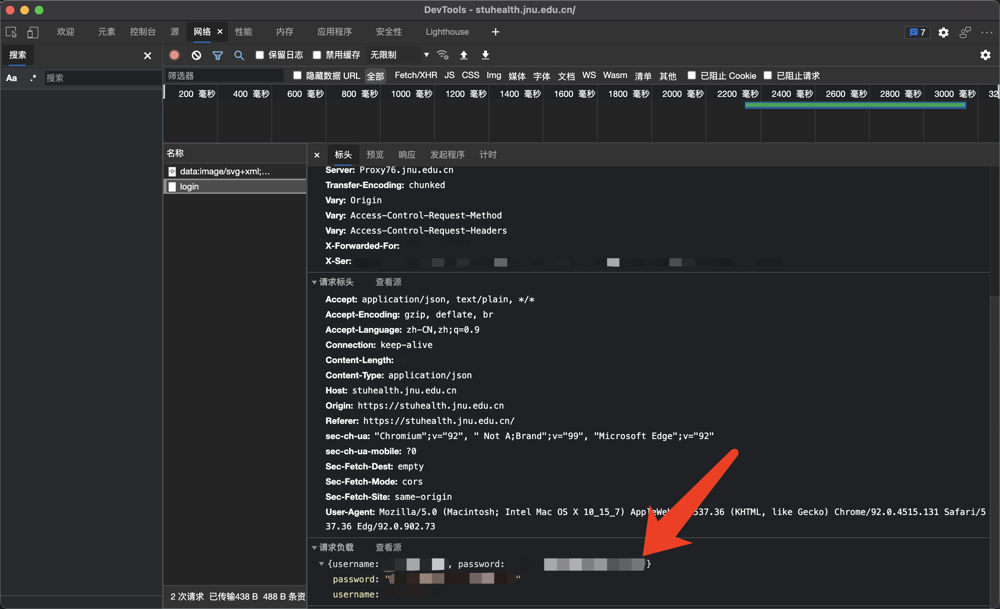

# 暨南大学学生健康打卡脚本


基于 Go 的暨南大学学生健康打卡脚本。

## 目录

- [下载链接](#links)
- [用法](#usages)
- [交叉编译](#build)
  - [在 Windows x86 平台上构建](#build-windows-x86)
  - [在 Windows x64 平台上构建](#build-windows-x64)
  - [在 MacOS x64 平台上构建](#build-macos-x64)
  - [在 Linux x86 平台上构建](#build-linux-x86)
  - [在 Linux x64 平台上构建](#build-linux-x64)

## <a name="links"></a> 下载链接

- Windows x86：[report_Windows_i386.exe](https://github.com/azxj/jnu-stu-health-report/releases/download/v1.0/report_Windows_i386.exe)
- Windows x64：[report_Windows_x86-64.exe](https://github.com/azxj/jnu-stu-health-report/releases/download/v1.0/report_Windows_x86-64.exe)
- MacOS x64：[report_Darwin_x86-64](https://github.com/azxj/jnu-stu-health-report/releases/download/v1.0/report_Darwin_x86-64)
- Linux x86：[report_Linux_i386](https://github.com/azxj/jnu-stu-health-report/releases/download/v1.0/report_Linux_i386)
- Linux x64：[report_Linux_x86-64](https://github.com/azxj/jnu-stu-health-report/releases/download/v1.0/report_Linux_x86-64)

## <a name="usages"></a> 用法

因为还没搞清楚网站对密码的哈希规则，所以需要先手动获取自己特定的密码哈希序列：

1. 访问[暨南大学学生健康打卡](https://stuhealth.jnu.edu.cn)登录界面
2. 打开浏览器的开发者工具（在 Chrome 和 Edge 上可以按 F12），点击“网络”
3. 在网页中填入学号和密码，点击登录按钮
4. 回到开发者工具，点开“login”请求，在“请求负载”中可以看到你自己的“password”（该字符串并不是你之前输入的密码）



在获取到自己的密码哈希序列之后，就可以执行以下脚本进行打卡（注意这里的“密码”指的是上面获取到的那个字符串）：

```shell
$ ./report_Darwin_x86-64 --username 学号 --password 密码
```

当输出“插入问卷数据成功”时，表示本次打卡成功；当输出“重复提交问卷”时，表示今日已经打过卡。

## <a name="build"></a> 交叉编译

### <a name="build-windows-x86"></a> 1. 在 Windows x86 平台上构建

```shell
$ GOOS=windows GOARCH=386 go build -o report_Windows_i386.exe
```

### <a name="build-windows-x64"></a> 2. 在 Windows x64 平台上构建

```shell
$ GOOS=windows GOARCH=amd64 go build -o report_Windows_x86-64.exe
```

### <a name="build-macos-x64"></a> 3. 在 MacOS x64 平台上构建

```shell
$ GOOS=darwin GOARCH=amd64 go build -o report_Darwin_x86-64
```

### <a name="build-linux-x86"></a> 4. 在 Linux x86 平台上构建

```shell
$ GOOS=linux GOARCH=386 go build -o report_Linux_i386
```

### <a name="build-linux-x64"></a> 5. 在 Linux x64 平台上构建

```shell
$ GOOS=linux GOARCH=amd64 go build -o report_Linux_x86-64
```
